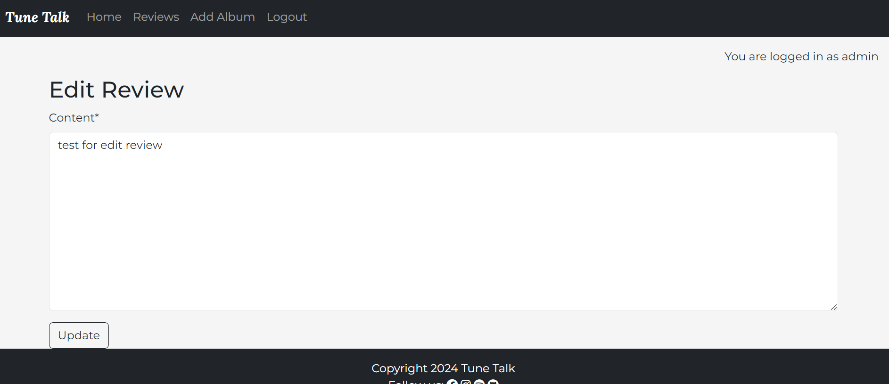

# Tune Talk

**is an Album Review Website that allows user to share their insights and opinions on various albums. Users can create accounts, write detailed reviews for album, and provide individual ratings. The average rating for each album is dynamically calculated based on the collective reviews, providing users with an overall perspective. Dive into the world of music exploration and join the community discussion on Tune Talk!**

Deployed version can be viewed [here](https://tune-talk-app-02b083d29396.herokuapp.com/).

# Purpose and Target Audience
> Purpose:
Tune Talk aims to provide a comprehensive platform for music enthusiasts to explore, discover, and engage with album reviews across various genres. Our primary purpose is to offer insightful and informative critiques that aid music lovers in making informed decisions about the albums they listen to. We strive to foster a community where individuals can share their passion for music, exchange opinions, and delve deeper into the artistic expressions encapsulated within each album.

> Target Audience:
Music Enthusiasts: Tune Talk appeals to individuals who have a profound love for music and are eager to explore new albums across diverse genres. Whether they are casual listeners or avid collectors, our platform offers a valuable resource for discovering compelling reviews and recommendations tailored to their tastes.

# User Stories
* As a site user I can view the website's home page so that I can learn about it and the services it offers.
* As a Site User I can create an account so that I can add album reviews.
* As a Site User I can see the site's social media links at the bottom of the webpage so that I can visit and follow them online.
* As a Site User I can view a paginated list of posts so that I can select which post I want to view
* As a Site User I can click on a post so that I can read the full text.
* As a Site User / Admin, I can view reviews on an individual post so that I can read the reviews
* As a Site User I want to discover new albums through reviews, so that I can explore and enjoy a variety of music
* As a Admin I want to easily create and publish album reviews so that I can share insights and recommendations with the audience
* As a Site User I want to rate albums, so that I can express my opinion and contribute to the community's understanding of the album's quality.
* As a Admin I can create, read, update, and delete posts so that I can manage my album review content
* As an Admin I can create draft posts so that I can finish writing the content later

# Agile
> This project was created using Agile principles via a projectboard on Github. This is the first time I have implemented Agile as an individual developer. However, creating user stories and identifying accepterance criteria acted as a roadmap to target the various features and functionalities of the application. It helped me stay on track and reduced distractions.

# UX Design Choices
>Color Scheme:
I just use black and white color scheme.

>Typography:
The following fonts were chosen for a clean and modern look that is both readable and minimal.
* Lora
* Montserrat
* Oswald

# Priority Features
### Homepage:
> Navbar and Hero Image

The landing page provides an introduction to the website with a call to action button encouraging new users to sign up. Signing up and logging in allows them access to view the available album and to add a album to the collection. The navigation bar is valuable for users as it provides quick and easy access to important sections of the website. The navigation bar includes links to Home, Reviews, Add Album, Register/Logout and Sign In.

### Registration:
> Registration allows users to add album, review album, and
 It allows them to edit and delete their reviews.
 

### Sign In:

### Sign Out:

### Album List:

### Album Details:

> Users are able to find more information about the album they are interested in. The album details include the title, artist, release year, genre, and album cover image. This provides users with sufficient information about the album.

### Review:

>Users can add albums review to the library via a form, and these albums will be visible on those specific album they reviewed.

### Edit Review:

### Edit Review Message:

### Delete Review:

### Add album:

> The form allows users to easily add an album to the library which will then be visible on the reviews page for the users to browse.

### Star Rating:

### Footer:

> Links in the footer redirect to respective social media pages.

# Future Features:
* Add tracklist to the album.
* A search engine where users can search for albums, songs, titles, and genres.
* User can listen to the songs.

# Wireframe
* Homepage:

* Album List and Album Detail:

* Mobile wireframe

* MObile Album List and Album Detail:

# Database Entity Relationship Diagram

.png)

- After deciding on what kind of project and features I wanted to implement I used a lucidchart to plan the database structure.
- The above diagram is serving as an initial guide to indicate the types and relationships between data stored

#### Data Models

>  User Model from Django
| Key | Name | Field |
| --- | --- | --- |
| PK | user_id |  |
| x | email |  |
| x | password |  |  

> Album Model
| Key | Name | Field |
| --- | --- | --- |
| x | title | CharField |
| x | artist | CharField |
| x | release_year | IntegerField |
| x | genre | CharField |
| x | featured_image | CloudinaryField |
| x | status | IntegerField |
| x | created_on | DateTimeField |
| x | updated_on | DateTimeField |

> Review Model
| Key | Name | Field |
| --- | --- | --- |
| FK | album | ForeignKey |
| FK | user | ForeignKey |
| x | content | TextField |
| x | created_on | DateTimeField |

> Rating Model
| Key | Name | Field |
| --- | --- | --- |
| FK | user | ForeignKey |
| FK | album | oreignKey |
|  | rating | IntegerField |

# Flow Chart
.png)

During the process of creating the app, I found the flow chart to be an efficient way to make important decisions. It helped me narrow down which decisions were important for both the users and the admin, and it also helped me establish the appropriate authentication. Additionally, the flow chart allowed me to determine which features were the most essential for the app to function properly.

# Validation

## HTML
| Page | W3C URL | Screenshot | Notes |
| --- | --- | --- | --- |
| Home | W3C |  | Pass: No Errors |
| Album List | W3C |  | Pass: No Errors |
| Add Album | W3C |  | Pass: No Errors |
| Album Detail | W3C |  | Pass: No Errors |
| Edit Review | W3C |  | Pass: No Errors |
| Sign In | W3C |  | Pass: No Errors |
| Register | W3C |  | Pass: No Errors |

## CSS
I have used the recommended CSS Jigsaw Validator to validate my CSS file.
| Page | W3C URL | Screenshot | Notes |
| --- | --- | --- | --- |
| style.css | W3C |  | Pass: No Errors |

## Python
I have used the recommended PEP8 CI Python Linter to validate all of my Python files.
| Page | W3C URL | Screenshot | Notes |
| --- | --- | --- | --- |
| Home | W3C |  | Pass: No Errors |
|  | W3C |  | Pass: No Errors |
|  | W3C |  | Pass: No Errors |
|  | W3C |  | Pass: No Errors |
|  | W3C |  | Pass: No Errors |

# Responsiveness
Development tools were used to test responsiveness on varying sized devices including laptop, mobile and tablet size.

Full testing was performed on the following devices:

Laptop:
* Lenovo ideapad 14" screen

Mobile Device:
* Android Device Oneplus

Browser Compatibility:
>  I have tested the site using the following browsers:

* Google Chrome

* Microsoft Edge

Mobile Device:
 

# Testing

# Tools and Technologies Used
The technologies implemented in this application included HTML5, CSS, Bootstrap, Python and Django.
* Python used as the back-end programming language.
* Git used for version control. (git add, git commit, git push)
* GitHub Project Management Board
* GitHub Pages used for hosting the deployed front-end site.
* Gitpod used as a cloud-based IDE for development.
* Bootstrap used as the front-end CSS framework for modern responsiveness and pre-built components.
* ElephantSQL used as the Postgres database.
* Heroku used for hosting the deployed back-end site.
* Cloudinary used for online static file storage.
* Balsalmiq for the warframes
* Google, Stack Overflow, and ChatGPT utilized for general research or solving a bug, information gathering, and various online tools.

# Language Used
* HTML5
* CSS
* Python

# Deployment
I used the steps from LMS and the Django deployment instructions that our facilitator gave for resources.

# Bugs
> I encountered several bugs when working on this project. Some of them have been resolved, such as the issue where uploaded images were not displayed.
* upload image not displayed

* fixed

> After I push my project and deployed to Heroku, I run the server again in gitpod and got an error messages indicate that the server is responding with the wrong MIME type for CSS and JavaScript.

> The hero image doesn't show on the homepage.

# Resources
* Code Institute Full Stack Development course materials
* Django documentation
* Django Deployment Instructions
* Bootstrap docs
* Stack overflow
* Slack

# Credits and acknowledgements
* Main structure of page reference used from Django Blog through the project from codeinstitute. 
* [Hero image](https://www.bing.com/images/create/tune-talk-hero-image-without-people-minimalist-pas/1-65fccf08e2544a229725dae4adcdc759?id=V2lUP9Vvsp3jZKH%2FRXgdoA%3D%3D&view=detailv2&idpp=genimg&noidpclose=1&thId=OIG3.4mzPkHjFZs1LBYOFgjoX&FORM=SYDBIC&ssp=1&darkschemeovr=1&safesearch=moderate&cc=IE&PC=SANSAAND) generated image by Microsoft Bing Copilot
* Font Awesome was used for icons and the fonts used were derived from Google Fonts.
* Album cover images were taken from Google and Wikipedia.
* Album Reviews are gerenated from ChatGPT.
* Balsalmiq for warframes
* Lucidchart for the Database Entity Relationship Diagram and Flow Chart.
* A special thanks to all individual in our cohort for their continuos support throughout the course.
* My mentor Gareth Mc Girr for his patience and all the help and support and for the resources that he shared for my star rating 

